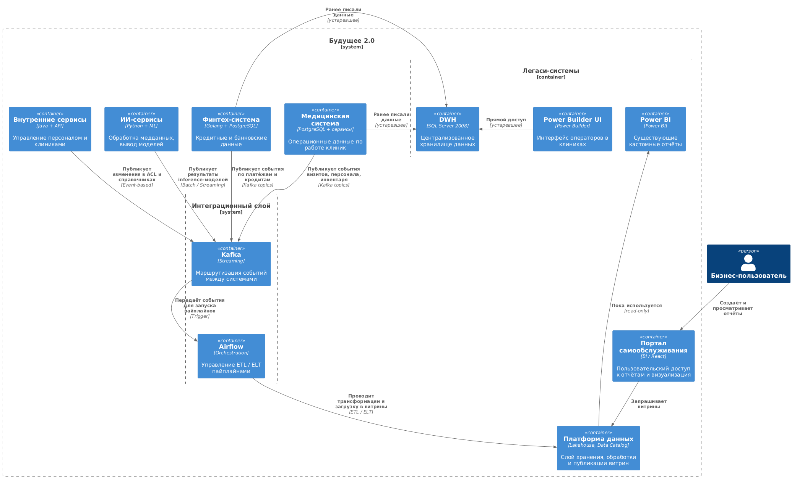

# Task 1 — Архитектура контейнеров и анализ проблем

## Архитектура контейнеров (C4)

## Проблемные места

| № | Проблема | Описание | Последствия |
|---|----------|----------|-------------|
| 1 | **Монолитный DWH** | Старый SQL Server 2008 — медленно, не масштабируется | Замедление отчётов, time-to-market |
| 2 | **BI-система требует кастомизации** | Power BI сложен, требует спецнавыков | Пользователи не могут работать самостоятельно |
| 3 | **Интеграционная шина устарела** | Apache Camel выступает как ESB (маршрутизация, трансформации, API), не масштабируется и не поддерживает событийную архитектуру | Требуется полная замена на Kafka + Airflow, с выносом логики и пересборкой всех интеграций |
| 4 | **Нет управления доступом и каталога данных** | Невозможно понять, кто владеет какими данными | Утечки, дублирование, хаос в правах |
| 5 | **Нет событийной архитектуры** | Все данные «вытягиваются» по расписанию | Нет realtime-аналитики, задержки в отчётах |

---

## Приоритизация проблем (MoSCoW)

| Приоритет | Проблема |
|-----------|----------|
| **Must** | Монолитный DWH, Сложный BI, Нет управления данными |
| **Should** | Устаревшая шина |
| **Could** | Нет событийной архитектуры |
| **Won’t (сейчас)** | Полный отказ от Power BI (временно сохраняется в read-only) |

---

## Вывод

Реализация Data Platform с self-service порталом и отделение источников от хранения — ключ к масштабируемой архитектуре. Это обеспечит независимость бизнесов, ускорит аналитику и снизит нагрузку на легаси-системы.

