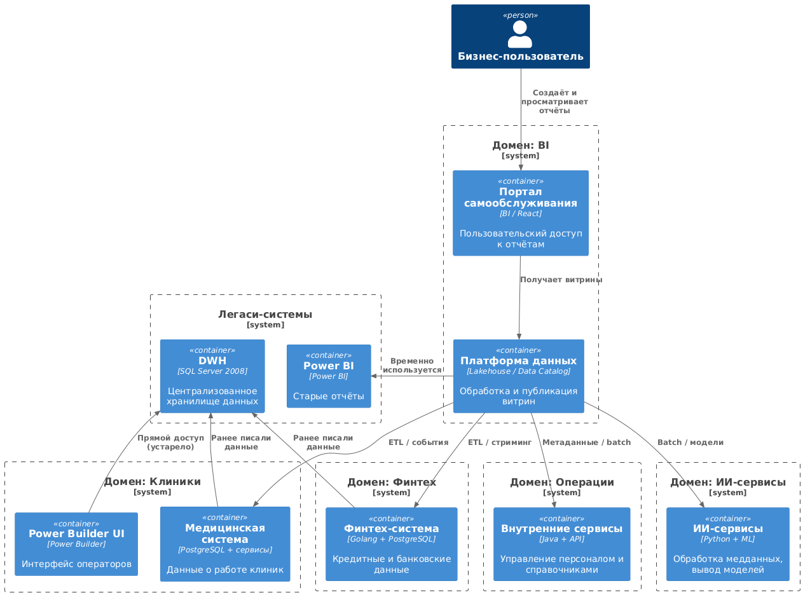

# Task 2 — Разделение на домены

## Подход

В качестве основы взята диаграмма контейнеров.  
На неё наложены **границы доменов**, соответствующие границам ответственности в бизнесе.

## Выделенные домены

- **Клиники**: медицинская система, Power Builder UI
- **Финтех**: финтех-система, финансовая отчётность
- **ИИ-сервисы**: сервисы обработки данных и моделей
- **Операции**: учётки, справочники, внутренняя логика
- **Аналитический домен (BI)**: портал, платформа данных, Power BI

## Потоки данных

Все домены публикуют витрины в Платформу данных.  
BI-домен читает витрины и предоставляет их бизнесу через портал.

## Зачем это нужно

- Каждый домен независим, может публиковать данные без изменений в DWH
- Новые бизнесы легко подключаются (например, фармацевтика, электроника)
- Улучшается time-to-market: домены сами контролируют свои данные
- Витрины становятся понятными, управляемыми, с SLA

