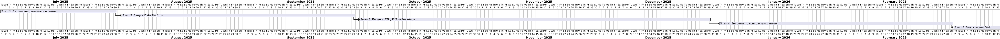

# Task 3 — Технический радар, роадмап и обоснование изменений

## Технический радар

| Ring    | Category       | Технология / Методология     | Комментарий |
|---------|----------------|------------------------------|-------------|
| **Adopt** | Platform       | Lakehouse (на базе S3 / Delta) | Новый стандарт хранения аналитических данных |
| **Adopt** | Tools          | Apache Airflow               | Оркестрация ETL / ELT пайплайнов |
| **Adopt** | Visualization  | BI-портал (Self-service, Power BI embedded / Metabase / Superset) | Доступ бизнесу без разработчиков |
| **Adopt** | Integration    | REST API между доменами      | Стандартизированная интеграция |
| **Adopt** | Methodology    | Data Contracts                | Стабильность схем при передаче данных |
| **Trial** | Platform       | Kafka / EventBridge           | Переход к событийной архитектуре между доменами |
| **Trial** | Tools          | dbt                           | Тестирование подхода для аналитических трансформаций |
| **Trial** | Methodology    | Data Mesh                    | Распределённая модель владения данными по доменам |
| **Trial** | Architecture   | ACL / Data Catalog            | Каталогизация и доступ по ролям |
| **Assess**| Tools          | Great Expectations            | Автотесты данных на витринах |
| **Assess**| Techniques     | Change Data Capture (CDC)     | Обновления в реальном времени из источников |
| **Assess**| Language       | TypeScript в BI-портале       | Возможное расширение на front-end |
| **Hold**  | Platform       | SQL Server 2008               | Легаси, работает только в readonly |
| **Hold**  | UI             | Power Builder                 | Устаревший интерфейс, на выход |
| **Hold**  | Integration    | Apache Camel                  | Устаревшая интеграционная шина |
| **Hold**  | Tools          | Кастомный ETL на SQL + скриптах | Плохо масштабируется, нестабильно |

---

## Роадмап трансформации

---

## 💬 Обоснование изменений

- **Выделение доменов** даёт гибкость и независимость. Домены публикуют витрины и не зависят от одного центра.
- **Data Platform** — основа новой архитектуры: туда сливаются данные, оттуда читаются витрины.
- **Переход на Airflow/dbt** даёт прозрачные пайплайны, тестируемость и версионирование.
- **Self-service BI** снимает нагрузку с аналитиков: бизнес сам строит отчёты, не дожидаясь внедрения.
- **Отключение DWH** избавляет от технического долга, ускоряет отчётность, сокращает косты.
